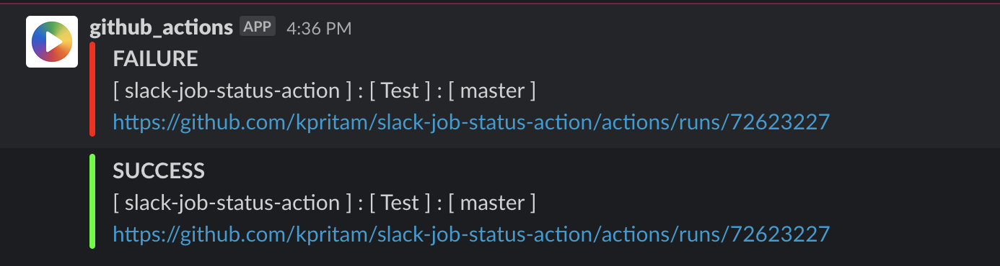

# Post Workflow Status To Slack

This action sends message to slack based on Job Status.
Gihub action sets the value for Job Status i.e. ${{ job.status }} based on whether step succeeded/failed/cancelled.

Possible values assinged to job status are follows:

1. Success
1. Failure
1. Cancelled

This action sends message using [Slack bot tokens](https://api.slack.com/docs/token-types).

## Inputs

### `job-status`

**(Required)** The `{{ job.status }}` used to decide slack message content i.e. status, color

| Status    | Color Hex | Color Name      |
| --------- | --------- | --------------- |
| Success   | #00FF00   | Pure Lime Green |
| Failure   | #FF0000   | Pure Red        |
| Cancelled | #EE6F47   | Bright Red      |

### `slack-bot-token`

**(Required)**  The slack bot token required to post slack message

### `channel`

**(Required)**  Slack channel where job status message will be posted

## Usage

Here's an example of a workflow which has two jobs:

1. `success-notification`: Sends job succeeded message to `github-actions-test` slack channel

1. `failure-notification`: Sends job failed message to `github-actions-test` slack channel

```yaml
name: Test

on:
  push:
    branches:
      - master

jobs:
  success-notification:
    runs-on: ubuntu-latest
    steps:
      - uses: actions/checkout@v2
      - run: exit 0
      - name: Slack Success
        if: always()
        uses: kpritam/slack-job-status-action@v1
        with:
          job-status: ${{ job.status }}
          slack-bot-token: ${{ secrets.SLACK_BOT_TOKEN }}
          channel: github-actions-test

  failure-notification:
    runs-on: ubuntu-latest
    steps:
      - uses: actions/checkout@v2
      - run: exit 1
      - name: Slack Failure
        if: always()
        uses: kpritam/slack-job-status-action@v1
        with:
          job-status: ${{ job.status }}
          slack-bot-token: ${{ secrets.SLACK_BOT_TOKEN }}
          channel: github-actions-test

```

Slack message for build success or failure would look like this:



## Slack Bot Setup

This action is inspired from [slack-action](https://github.com/abinoda/slack-action), follow instruction [here](https://github.com/abinoda/slack-action#setup) for setting up slack bot.
